# 🔐 Activité Pratique N°4 – Partie 2 : Sécurisation d'une Architecture Full-Stack (Spring Boot & Angular)

Ce dépôt présente la suite de l'activité pratique sur la sécurité applicative. Cette étape se concentre sur l'intégration de **Keycloak** pour sécuriser une architecture micro-services complète et un frontend **Angular**. 

Cette activité est réalisée dans le cadre du module **Systèmes Distribués et DevOps** encadré par **Mr. Mohamed YOUSSFI**.

---

## 🎯 Objectifs de la Partie 2

- **Sécurisation des Micro-services** : Protection des services `inventory-service` et `order-service` via Spring Security et OAuth2 Resource Server.
- **Intégration Frontend** : Mise en œuvre du SSO dans `ecom-angular-app` avec `keycloak-angular`.
- **Contrôle d'accès (RBAC)** : Gestion des autorisations basées sur les rôles `ADMIN` et `USER` créés en Partie 1.
- **Multi-Factor Authentication (MFA)** : Configuration et test du protocole **OTP** (One-Time Password).
- **Propagation du Contexte** : Analyse de la transmission des JWT entre le client et les services.

---

## 🛠️ Environnement Technique

- **Backend** : Spring Boot 3, Spring Security, OAuth2 Resource Server.
- **Frontend** : Angular 17, Bootstrap, Bootstrap Icons.
- **IAM** : Keycloak 19.
- **Communication** : OpenFeign, HttpClient.

---

## 📂 Organisation du Projet
├── 📁 ecom-angular-app       # Frontend Angular sécurisé
├── 📁 inventory-service      # Micro-service Catalogue (Resource Server)
├── 📁 order-service          # Micro-service Commandes (Resource Server)
├── 📁 captures               # Preuves de tests et captures d'écran
└── 📝 pom.xml                # Descripteur de projet Maven Parent

---

## 📌 Travail Réalisé

### 1. Sécurisation Backend (Spring Boot)
- Configuration du serveur de ressources pour valider les tokens JWT émis par le Realm `ecom-realm`.
- Création de convertisseurs pour extraire les autorités depuis les claims du JWT (`realm_access.roles`).
- Résolution des problèmes de **CORS** pour autoriser les requêtes provenant du port d'Angular.

### 2. Client Angular & Keycloak
- Initialisation du `KeycloakService` via `APP_INITIALIZER`.
- Création d'une interface réactive affichant le profil de l'utilisateur connecté.
- Implémentation de `AuthGuard` pour protéger les routes `/products` et `/orders`.

### 3. Fonctionnalités de Sécurité Avancées
- **OTP** : Configuration de l'authentification à deux facteurs pour l'utilisateur `sanji`.
- **Registration** : Activation de l'auto-enregistrement des utilisateurs sur Keycloak.
- **Forbidden Access** : Gestion des accès refusés (403) pour les utilisateurs sans privilèges suffisants.

---

## 📸 Captures d'écran

| Description | Capture |
|-------------|---------|
| **Interface Home** | 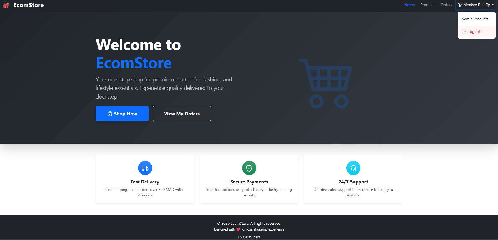 |
| **Login Keycloak** | 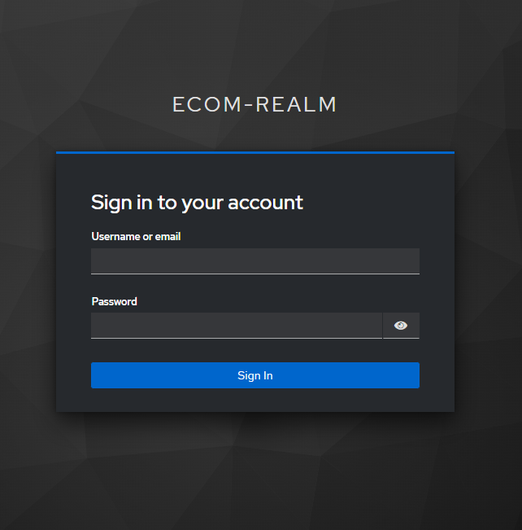 |
| **Analyse JWT (Admin)** | 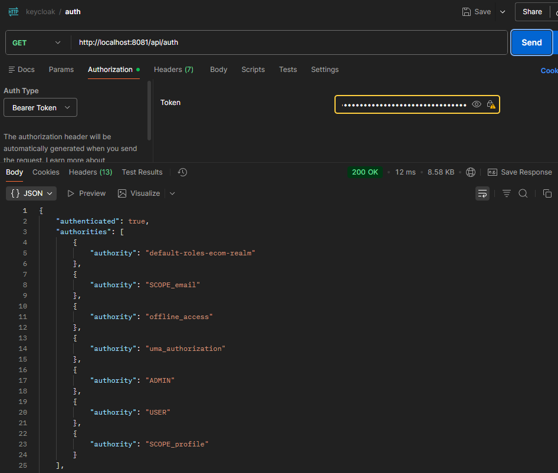 |
| **Analyse JWT (User)** | 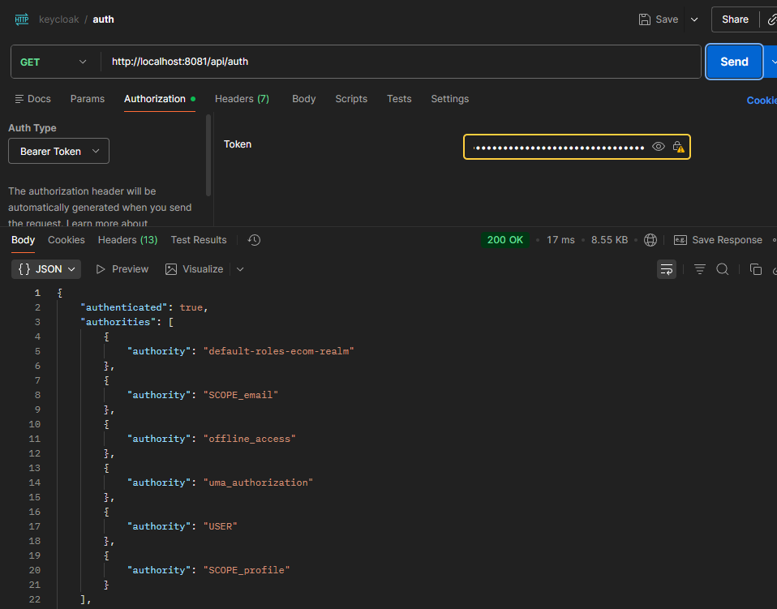 |
| **Configuration OTP (Sanji)** | 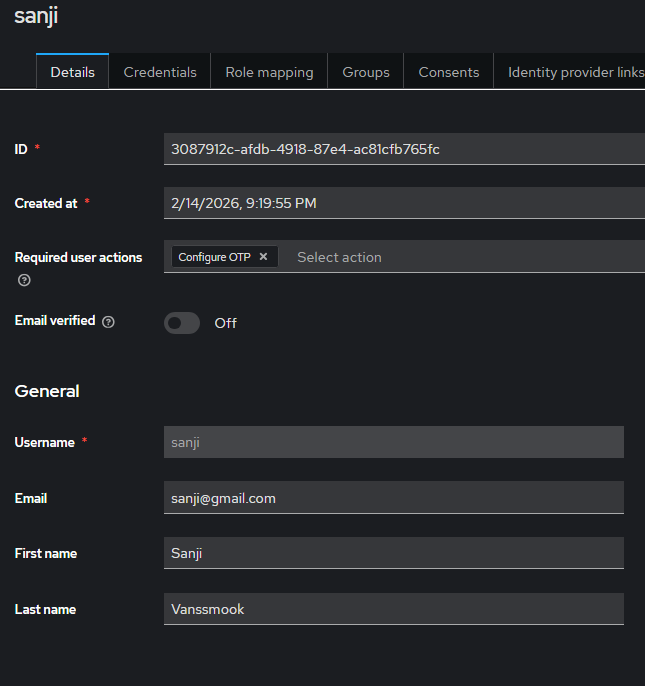 |
| **Validation OTP** | 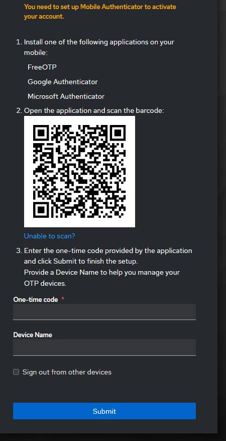 |
| **OTP Terminé** | 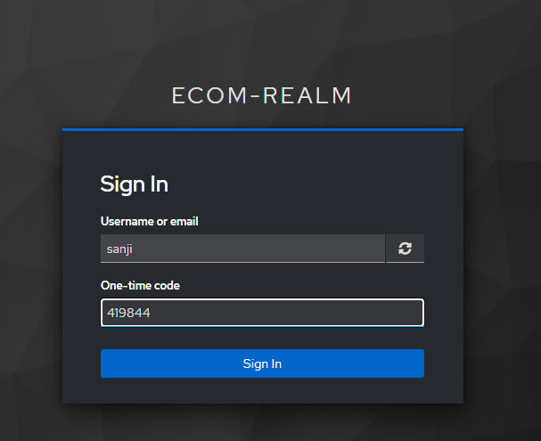 |
| **Liste des Produits** |  |
| **Accès Admin (Produits)** | 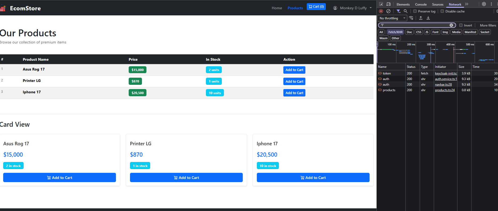 |
| **Accès User (Produits)** |  |
| **Erreur CORS (Debug)** | 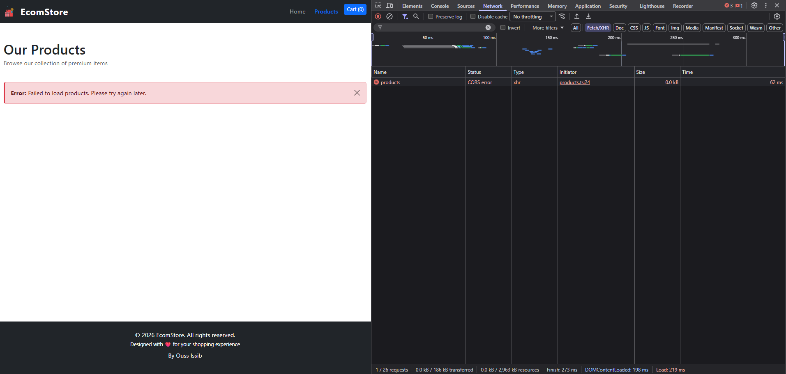 |
| **Liste des Commandes** | 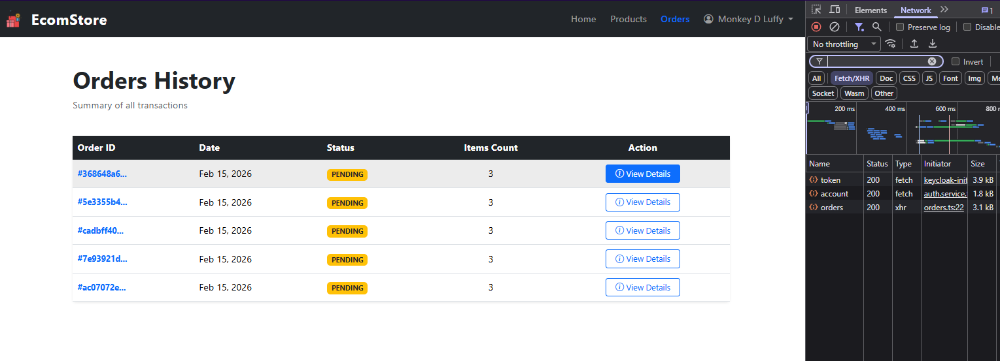 |
| **Détails d'une Commande** | 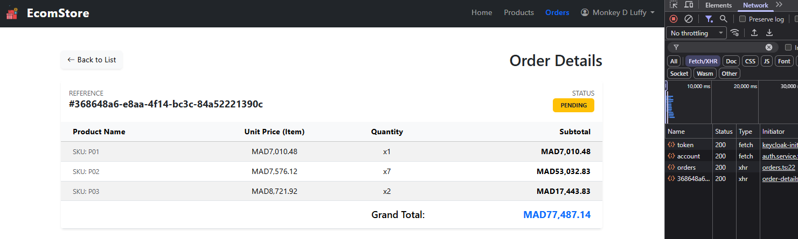 |
| **Rôle User (Commandes)** |  |
| **Accès Refusé (403)** | 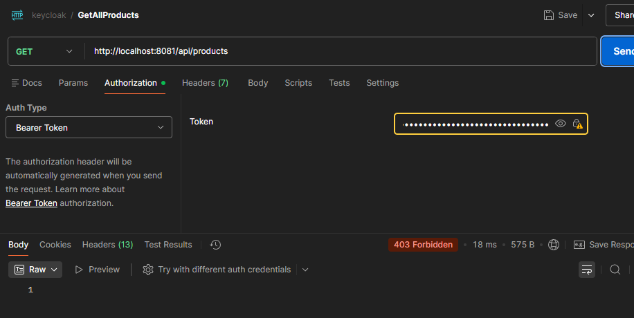 |
| **Formulaire d'enregistrement** | 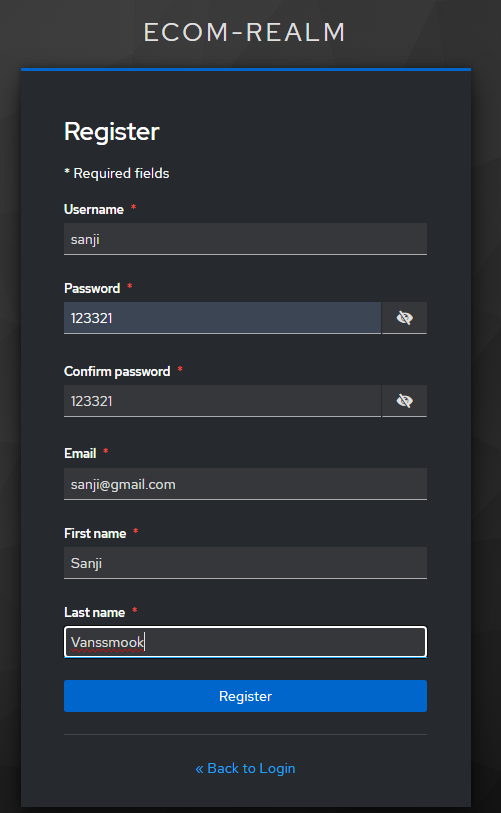 |
| **Enregistrement réussi** | 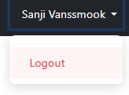 |
| **Déconnexion** | 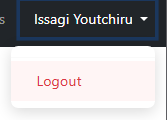 |

---
*Réalisé par **Nizar** - 2026*
